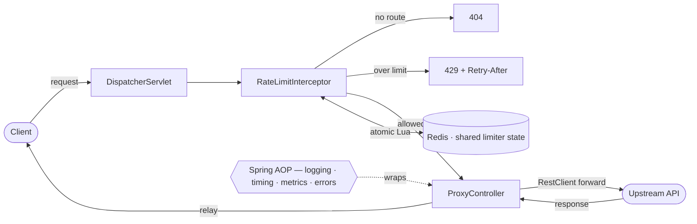

# Rate Limiter / API Gateway

A lightweight, horizontally-scalable **API gateway / reverse proxy** that fronts any HTTP API
and enforces configurable **per-route rate limiting**. It implements five classic algorithms —
**token bucket, leaking bucket, fixed window, sliding window log, and sliding window counter** —
with limiter state held in **Redis** and evaluated by **atomic Lua scripts**, so limits hold in
aggregate across every instance behind a load balancer. Routes, upstreams, and per-endpoint
limits are declared in **YAML**; allowed requests are forwarded to their upstream and the
response is relayed back, while request logging, latency timing, **Micrometer** metrics, and
uniform error handling are applied as **Spring AOP** cross-cutting concerns. It's built on the
**Spring Framework (Spring MVC)** with **no Spring Boot and no auto-configuration** —
`DispatcherServlet`, `HandlerInterceptor`s, and beans are wired by hand — to demonstrate Spring
framework internals and distributed-systems fundamentals end to end.

**Stack:** Java 21 · Spring Framework 6 (Spring MVC, Spring AOP) · embedded Tomcat · Redis + Lua
(Lettuce, Spring Data Redis) · Micrometer · SLF4J / Logback · Jackson (YAML) · Maven

## Architecture



Routes and their per-endpoint limits come from `input.yaml`; the interceptor resolves the route
(via Spring `PathPattern`), runs that route's algorithm in Redis, and either rejects the request
(`429`/`404`) or lets `ProxyController` forward it and relay the upstream's response.

## How to run

**Prerequisites:** Java 21, Maven, and a running Redis (e.g. `docker run -p 6379:6379 redis`).

```bash
# 1. Point routes at your upstreams in src/main/resources/input.yaml
#    (Redis host/port live in src/main/resources/application.properties)

# 2. Build and run
mvn package
java -jar target/my-rate-limiter-0.0.1-SNAPSHOT.jar   # serves on :8080

# 3. Send traffic through the gateway (X-Forwarded-For sets the client key)
curl -H "X-Forwarded-For: 1.2.3.4" http://localhost:8080/<your-route-path>

# 4. Inspect metrics
curl http://localhost:8080/gateway/metrics
```

Example route in `input.yaml`:

```yaml
routes:
  - id: search-api
    upstream: https://httpbin.org
    paths: ["/get", "/status/**"]
    limiter:
      type: token_bucket    # token_bucket | leaking_bucket | fixed_window | sliding_window_counter | sliding_window_log
      bucketSize: 50
      interval: 1000
      refillSize: 50
```

## Design decisions

- **No Spring Boot, by choice.** Wiring `DispatcherServlet`, interceptors, and beans by hand
  works directly with the framework instead of around Boot's auto-configuration — the goal was to
  understand Spring's internals, not to hide them.
- **Redis + Lua for the counters.** State must be shared so the limit holds across instances
  behind a load balancer, and the read-modify-write decision must be atomic. A Lua script runs the
  whole check-and-update as one indivisible operation on the server, eliminating cross-instance
  races in a single round trip; Redis key TTLs self-expire idle state, keeping memory bounded.
- **Rate limiting in an interceptor; observability in AOP.** The limit decision has to
  short-circuit *before* the controller (return `429`/`404`), which is exactly what a
  `HandlerInterceptor` does. Spring AOP is reserved for cross-cutting concerns that *wrap* rather
  than *gate* a request — access logging, latency timing, metrics, and uniform error handling —
  keeping that boilerplate out of the forwarding code.
- **YAML-driven routing.** Upstreams, path patterns, and per-endpoint limits are configuration,
  not code, so behaviour can be added or retuned without a rebuild.
- **Five algorithms behind one interface.** Token bucket and leaking bucket trade burst tolerance
  for smoothing; fixed/sliding windows trade accuracy for memory — implementing all five makes
  those trade-offs explicit and selectable per route.
- **Reverse proxy with faithful relay.** `RestClient.exchange` passes the upstream's real status
  through (a backend `404` stays a `404`, not a masked `500`), and hop-by-hop headers are stripped
  in both directions so the gateway is transparent.
